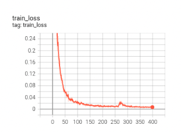
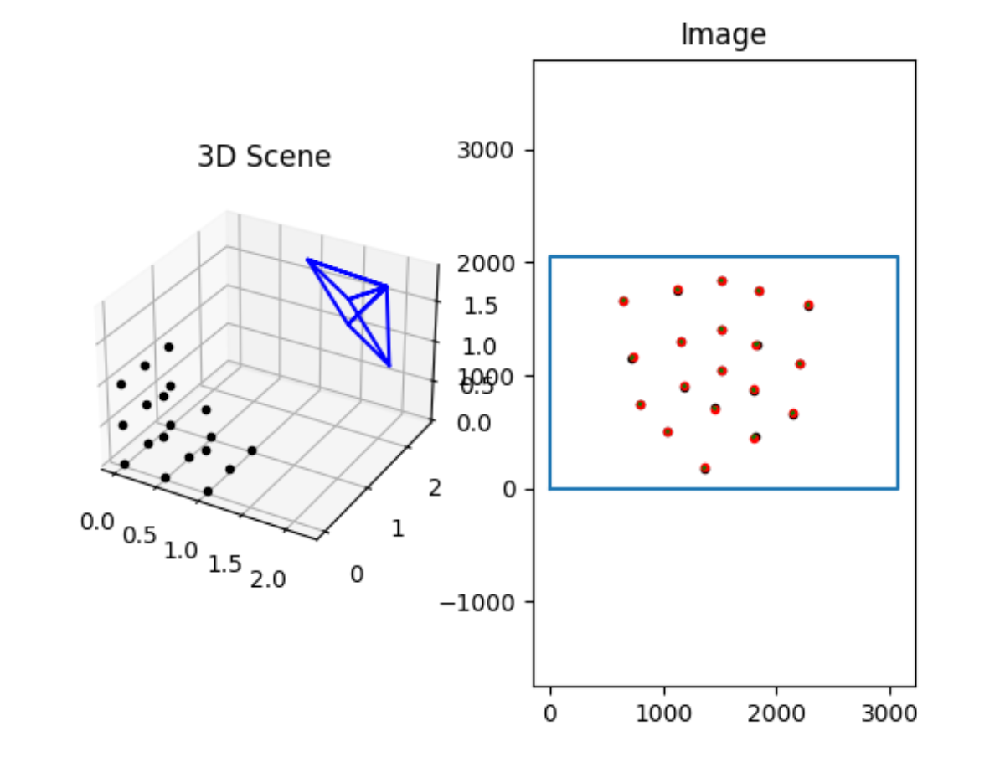
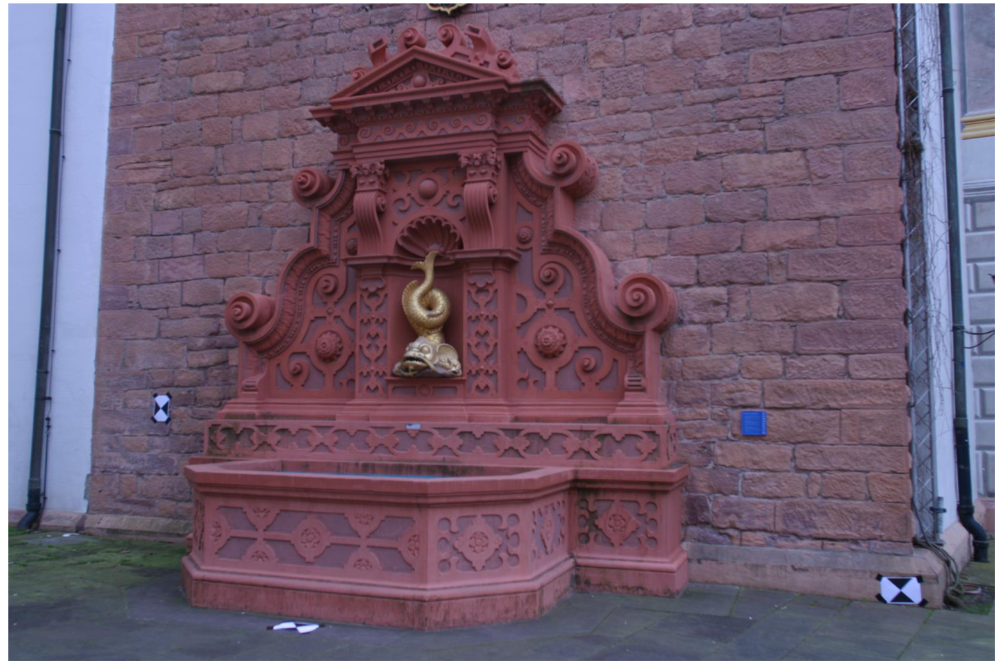
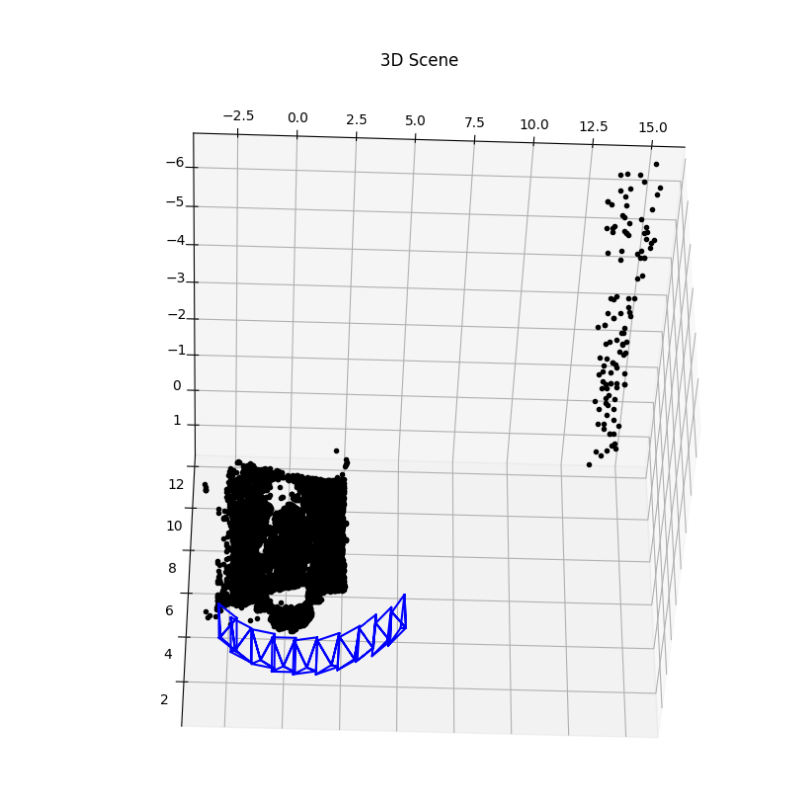
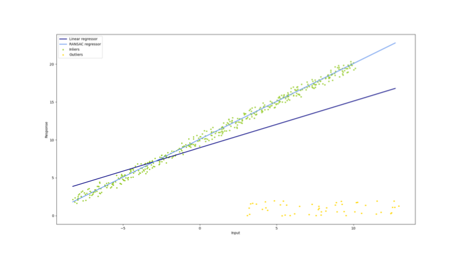
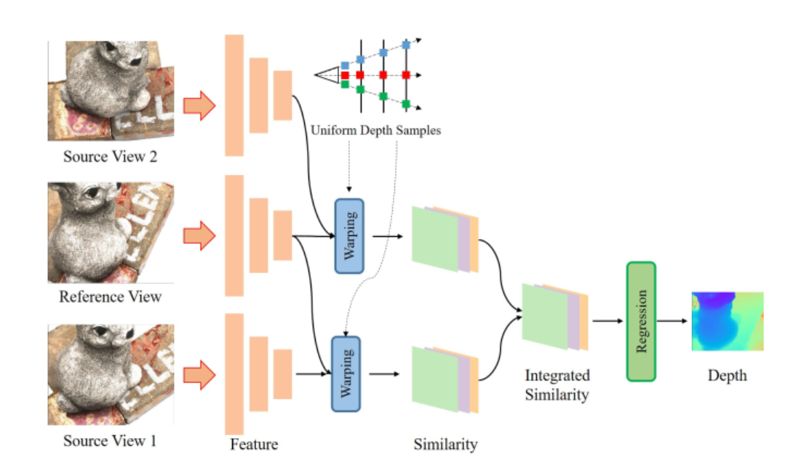
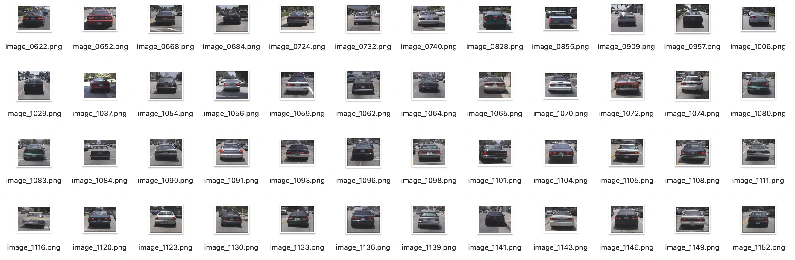
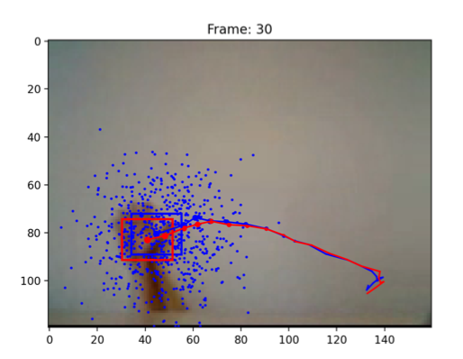
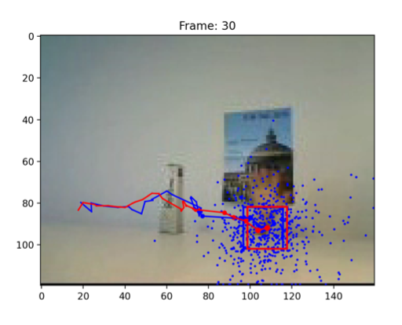
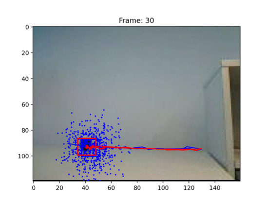

# Computer vison course projects 
This branch collect all the code assignment as well as the report of the ETHz course Computer vison. I get full grade for all these projects.

- **Computer vison assignments**
    - **exercise1: Introduction**
        - Introduction to Pytorch
    - **exercise2: Image Segmentation**
        - Mean-Shift
        - SegNet
    - **exercise3: Camera calibration and structure from motion**
        - DLT Algorithm
        - Structure from motion
    - **exercise4: Model fitting and multi-view vision**
        - Model Fitting 
        - Stereo/Multi-view vision
    - **exercise5: Object Recognition**
        - Bag-of-words Classifier
        - CNN-based Classifier
    - **exercise6: Tracking**
        - CONDENSATION: Tracker Based On Color Histograms

To protect the property of the teaching staff I only show my reports here, not the code

## exercise1: Introduction
Introduction to Pytorch, A demo for getting used to pytorch modules

## exercise2:Image Segmentation

### Mean-Shift
I use the mean shift algorithm with gaussian kernel with 2.5 bandwidth and get following results:

 
 

### SegNet
I use the SegNet(Like UNet) and get following results:

 

## exercise3: Camera calibration and structure from motion**

### DLT Algorithm
The reprojection error is 6.253e-4

 

### Structure from motion

The reprojection error is 6.253e-4
I use the global SFM instead of the sequential SFM get better resutls.

 
 

## exercise4: Model fitting and multi-view vision
### Model Fitting 
I implement the ransac line fitting alogrithm and is robust to the outlier of these yellow points.

 

### Stereo/Multi-view vision
I implement the MVS Net for the dense depth estimation task and get good results.

 
 

## exercise5: Object Recognition
### Bag-of-words Classifier
In this task I solve the car recognition task using bag-of-words classifier and conduct the experiment about how different cluster number will influence the results.

 
 

### CNN-based Classifier
In this task I solve the CIFAR-10 Dataset using simplified VGG net and achieve 82% accuracy.

 

 

## exercise6: Tracking
### CONDENSATION: Tracker Based On Color Histograms
In this task I use the particle tracking alogrithm based On Color Histograms. Below are the results for different tracking challenge.

 
 
 

## Conclusion

I really learned a lot during this courses and will keep going forward to dive more in the topic of computer vision and deep learning